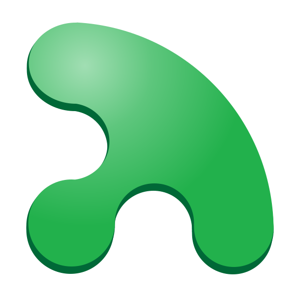

**Looking for contributors and beta testers!**

# Gumby

## Climbing for All

Gumby's mission is to ensure that climbing is an inclusive, safe, and alluring sport for generations to come!

### Your Climbing
Gumby is a community of climbers all working hard to take their climbing to the next level. Gumby is here to make that as easy as ever whether you are on your first climb or your 100th project!

- Track: Start tracking all of your climbs in the **Journal** section of the app.
- Plan: See where you are and plan out your future goals in the **You** section of the app.
- Achieve: Gumby will provide recommendations based on your **Journal** and **You** history so you can get the most out of every session. 

### Your Community
Gumby is a community of climbers trying to keep climbing safe and accessible for people of all backgrounds.

- Meet: Find other climbers with your aspirations in the **Meet** section!
- Support: Interested in helping support this community, local crags, or climbing in general, visit the **Donate** section to see how you can help.
- Lead: Are you a routesetter, guide, crag maintainer, or professional climber, head over to the **You** section to let us know, so we can ensure people looking to connect and support can find you!
